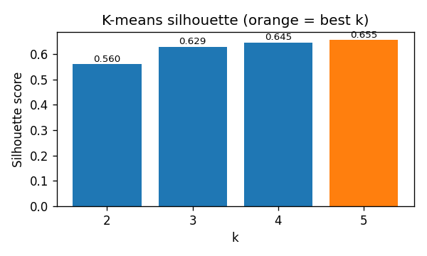

# Test 8 — PLC Severe-Failure Characterization

Severe-failure threshold: |err| > 100 Nm  — total failures analyzed: **234**

## Silhouette Scores

| k | silhouette |
|---|-----------|
| 2 | 0.5598 |
| 3 | 0.6289 |
| 4 | 0.6452 |
| 5 | 0.6552 ← best |

Best k = **5**

## Cluster Summary

| Cluster | N | % | Description |
|---------|---|---|-------------|
| C0 | 60 | 26% | torDes≈0 (mean=+0.0  std=0.0); moving (velAct_mean=-3.73 rad/s); torDes zero >500 samples (loading long past); signs: torAct=+ torEst=- i=- |
| C1 | 131 | 56% | torDes≈0 (mean=+0.0  std=0.0); moving (velAct_mean=-6.32 rad/s); torDes zero >500 samples (loading long past); signs: torAct=+ torEst=- i=- |
| C2 | 14 | 6% | torDes≈0 (mean=+0.0  std=0.0); torEst swinging (std=74 Nm); moving (velAct_mean=+3.07 rad/s); torDes zero >500 samples (loading long past); signs: torAct=+ torEst=- i=- |
| C3 | 15 | 6% | torDes≈0 (mean=+0.0  std=0.0); moving (velAct_mean=-2.28 rad/s); torDes zero >500 samples (loading long past); signs: torAct=+ torEst=- i=- |
| C4 | 14 | 6% | torDes≈0 (mean=+0.0  std=0.0); torEst swinging (std=62 Nm); torDes zero >500 samples (loading long past); signs: torAct=+ torEst=- i=- |

## Centroid Feature Table

| Feature | C0 | C1 | C2 | C3 | C4 |
|---------|------|------|------|------|------|
| torDes_mean | +0.00 | +0.00 | +0.00 | +0.00 | +0.00 |
| torDes_std | +0.00 | +0.00 | +0.00 | +0.00 | +0.00 |
| torDes_min | +0.00 | +0.00 | +0.00 | +0.00 | +0.00 |
| torDes_max | +0.00 | +0.00 | +0.00 | +0.00 | +0.00 |
| torAct_mean | +106.56 | +106.56 | +106.56 | +106.56 | +106.56 |
| torAct_std | +0.00 | +0.00 | +0.00 | +0.00 | +0.00 |
| torAct_min | +106.56 | +106.56 | +106.56 | +106.56 | +106.56 |
| torAct_max | +106.56 | +106.56 | +106.56 | +106.56 | +106.56 |
| torEst_mean | -70.46 | -14.25 | +13.66 | -109.63 | -72.49 |
| torEst_std | +11.32 | +3.48 | +73.97 | +9.71 | +61.77 |
| torEst_min | -88.26 | -19.01 | -107.42 | -118.45 | -118.45 |
| torEst_max | -55.20 | -9.62 | +99.18 | -94.21 | +43.35 |
| velAct_mean | -3.73 | -6.32 | +3.07 | -2.28 | +0.76 |
| velAct_std | +0.53 | +0.15 | +0.70 | +2.78 | +2.86 |
| velAct_min | -4.59 | -6.52 | +2.42 | -4.61 | -4.61 |
| velAct_max | -3.08 | -6.09 | +4.39 | +2.42 | +2.81 |
| i_mean | -23.68 | -5.24 | +7.95 | -34.34 | -18.77 |
| i_std | +3.92 | +0.78 | +20.61 | +6.12 | +18.41 |
| dt_since_torDes_nonzero | +500.00 | +500.00 | +500.00 | +500.00 | +500.00 |
| dt_since_torAct_below20 | +223.50 | +319.00 | +157.50 | +186.00 | +171.50 |
| sign_torAct | +1.00 | +1.00 | +1.00 | +1.00 | +1.00 |
| sign_torEst | -1.00 | -1.00 | -1.00 | -1.00 | -1.00 |
| sign_i | -1.00 | -1.00 | -1.00 | -1.00 | -1.00 |

## Canonical Failure Check (idx=38180)

idx=38180 is **not** in the PLC severe-failure set under this evaluation.

## Loading-Phase Diagnostic

Fraction of the 30-sample input window with |torDes| > 10 Nm:
  mean=0.000  median=0.000  max=0.000

Failures with zero loading in window: 234 (100%)
Failures with ≥50% loading in window: 0 (0%)

## File × Cluster Cross-Reference

| file                   |   total |   C0 |   C1 |   C2 |   C3 |   C4 |
|:-----------------------|--------:|-----:|-----:|-----:|-----:|-----:|
| PLC_0.50-10_oldLim_exp |     234 |   60 |  131 |   14 |   15 |   14 |

## Cluster 0 Representative Window

![cluster 0 representative — PLC_0.50-10_oldLim_exp row=11007 leri=168 Nm global_idx=79321. Five time-series plots showing torque error, torque, velocity, and current measurements over 100 samples. All signals remain relatively stable near their mean values. Beige shaded region marks the model window from sample 30 to 60. Vertical dashed line at sample 60 indicates failure point. Horizontal blue line shows constant velocity around -3.73 rad/s. Torque desired stays at zero, actual torque near +106.56 Nm, estimated torque near -70.46 Nm with ±11.32 Nm variation, and current near -23.68 A with ±3.92 A variation. Characteristic signature of cluster 0: sustained mismatch between positive actual torque and negative estimated torque during zero-demand idle with backward motion.](test8_cluster_0_representative.png)

## Cluster 1 Representative Window

![cluster 1 representative — PLC_0.50-10_oldLim_exp row=11098 leri=115 Nm global_idx=80223. Five time-series plots showing torque error, torque, velocity, and current measurements over 100 samples. Beige shaded region marks the model window from sample 30 to 60. Vertical dashed line at sample 60 indicates failure point. Torque desired remains at zero throughout. Actual torque holds steady near +106.56 Nm. Estimated torque averages -14.25 Nm with ±3.48 Nm variation, showing minimal oscillation compared to cluster 0. Velocity trends around -6.32 rad/s, the most negative among all clusters, indicating rapid backward motion. Current averages -5.24 A with ±0.78 A variation, the smallest magnitude observed. All signals remain stable with low variance. Characteristic signature of cluster 1: high-speed backward motion with minimal torque estimation error during zero-demand idle, representing the largest failure subgroup at 56% of cases.](test8_cluster_1_representative.png)

## Cluster 2 Representative Window

![cluster 2 representative — PLC_0.50-10_oldLim_exp row=10942 leri=218 Nm global_idx=79687. Five time-series plots showing torque error, torque, velocity, and current measurements over 100 samples. Beige shaded region marks the model window from sample 30 to 60. Vertical dashed line at sample 60 indicates failure point. Torque desired remains at zero throughout. Actual torque holds steady near +106.56 Nm. Estimated torque swings significantly between -107.42 Nm and +99.18 Nm with mean +13.66 Nm and standard deviation +73.97 Nm, the highest oscillation among all clusters. Velocity trends around +3.07 rad/s, the only cluster with forward motion, ranging from +2.42 to +4.39 rad/s. Current varies between -118.45 A and +43.35 A with mean +7.95 A and standard deviation +20.61 A, showing substantial fluctuations. Characteristic signature of cluster 2: severe torque estimation swinging with forward motion during zero-demand idle, representing 6% of failures and distinguished by pronounced oscillatory behavior in torque estimation and current.](test8_cluster_2_representative.png)

## Cluster 3 Representative Window

![cluster 3 representative — PLC_0.50-10_oldLim_exp row=10972 leri=199 Nm global_idx=7897. Five time-series plots showing torque error, torque, velocity, and current measurements over 100 samples. Beige shaded region marks the model window from sample 30 to 60. Vertical dashed line at sample 60 indicates failure point. Torque desired remains at zero throughout. Actual torque holds steady near +106.56 Nm. Estimated torque averages -109.63 Nm with ±9.71 Nm variation, showing the most negative mean among all clusters. Velocity trends around -2.28 rad/s with high variability (std=+2.78 rad/s), ranging from -4.61 to +2.42 rad/s, indicating unstable motion direction. Current averages -34.34 A with ±6.12 A variation, the largest magnitude among all clusters. All signals show moderate oscillation. Characteristic signature of cluster 3: severe negative torque estimation with unstable bidirectional velocity during zero-demand idle, representing 6% of failures and distinguished by large current magnitude and inconsistent motion patterns.](test8_cluster_3_representative.png)

## Cluster 4 Representative Window

![cluster 4 representative — PLC_0.50-10_oldLim_exp row=10895 leri=162 Nm global_idx=78982. Five time-series plots showing torque error, torque, velocity, and current measurements over 100 samples. Beige shaded region marks the model window from sample 30 to 60. Vertical dashed line at sample 60 indicates failure point. Torque desired remains at zero throughout. Actual torque holds steady near +106.56 Nm. Estimated torque swings between -118.45 Nm and +43.35 Nm with mean -72.49 Nm and standard deviation +61.77 Nm, showing significant oscillation. Velocity trends around +0.76 rad/s with high variability (std=+2.86 rad/s), ranging from -4.61 to +2.81 rad/s, indicating unstable bidirectional motion. Current varies between -118.45 A and +43.35 A with mean -18.77 A and standard deviation +18.41 A, displaying substantial fluctuations. Characteristic signature of cluster 4: pronounced torque estimation swinging with unstable velocity during zero-demand idle, representing 6% of failures and distinguished by high-amplitude oscillations in both estimated torque and current with variable motion patterns.](test8_cluster_4_representative.png)

## Verdict

Many failure modes (best k=5, silhouette=0.655): C0=60 (26%), C1=131 (56%), C2=14 (6%), C3=15 (6%), C4=14 (6%). The backlash-ringing hypothesis from Test 5b applies to only a subset of failures — multiple distinct mechanisms present. idx=38180 not found in this evaluation split. Loading diagnostic: 100% of failures have zero |torDes| in the input window — the loading event precedes the SEQ_LEN=30 window, confirming that longer windows or state-carrier features are required.
